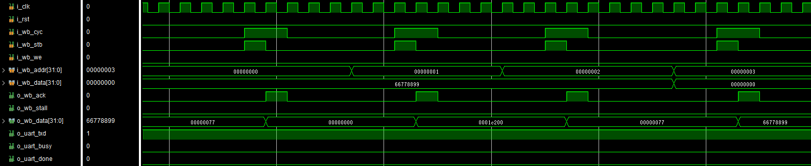

# wbUartTxSlave Module
A UART transmitter peripheral based on the wishbone bus (pipelined mode, single access)

# 💡 Feature
- Based on wishbone bus
- Pipelined mode
- Single access
- Fixed 8 data bits, 1 stop bit
- Programmable baud rate

# 🔌 Port Description
| Port Name     | Direction | Bit Width | Description
|---------------|-----------|-----------|---------------------------------|
|   i_clk       |   input   |   1       |   SYSCON clock signal           |
|   i_rst       |   input   |   1       |   SYSCON reset signal           | 
|   i_wb_cyc    |   input   |   1       |   wishbone input signal         |
|   i_wb_stb    |   input   |   1       |   wishbone input signal         |
|   i_wb_we     |   input   |   1       |   wishbone input signal         |
|   i_wb_addr   |   input   |   32      |   wishbone input signal         |
|   i_wb_data   |   input   |   32      |   wishbone input signal         |
|   o_wb_ack    |   output  |   1       |   wishbone output signal        |
|   o_wb_stall  |   output  |   1       |   wishbone output signal        |
|   o_wb_data   |   output  |   32      |   wishbone output signal        |
|   o_uart_txd  |   output  |   1       |   uart output signal            |
|   o_uart_busy |   output  |   1       |   uart output signal            |
|   o_uart_done |   output  |   1       |   uart output signal            |

# 🔧 Slave Register Description
|   Address     | Name    |   Bit Width   | R/W | Reset Value | Description | 
|---------------|---------|---------------|-----|-------------|-------------|
|   0x00000000  | STATUS  |     32        |  R  | 0x00000000  | BUSY[0:0]: Uart TX busy flag  1'b0: not busy  1'b1: busy  |
|   0x00000001  | BaudRate|     32        | R/W | 0x0001C200  | BAUDRATE[31:0]: Uart TX baudrate |
|   0x00000002  | TX Buffer|    32        | R/W |  0x00000000 | TXBUFFER[7:0]: Uart TX 8bit data buffer, Writing this register will trigger a transfer |
|   0x00000003  | NOT USED |    32        | R/W |  0x00000000 | NOT USED | 

# 📏 Timing Diagram
**Reset and read all registers:**

---

**Write REG0-2:**

Once REG2 is written, it will trigger a transmission.

---

**Writting to REG2 triggers a uart transfer:**

---

**Write REG3:**

---

**Read REG0-3**

From the above process, we can see that the read value corresponds to the written value.

